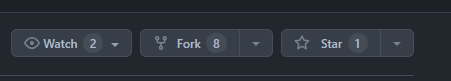

# Contributing to Hedging-of-Financial-Derivative

Thank you for considering contributing to our Financial Derivative Hedging project! We appreciate your interest and support in making this project better.

## Ways to Contribute

We welcome contribution in various forms, including but not limited to:

- Reporting bugs or issues 
- Providing feedback on the existing codebase
- Submitting fixes for identified issues
- Proposing new features or enhancement
- Improving documentation
- Adding code snippets, algorithms, or techniques related
to financial programming, deep learning, or machine learning

### Code of Conduct
Please make sure to read and follow our <a href="code_of_conduct.md">Code of Conduct</a> before contributing to the project.

### Getting Started

#### `Fork` the repository

<p>Create a personal copy of the Hedging-of-Financial-Derivatives repository on Github.</p>
<p>You can do this by clicking the Fork button on the Hedging-of-Financial-Derivatives repository page.</p>



#### Clone the repository locally:

After forking the repository, clone it locally on your computer so that you can work on the code and make changes.
```bash
     $ git clone https://github.com/<YOUR-USERNAME>/Road_Lane_Detection_System..git
```
#### Create a new branch:
<p>Before making any changes, create a new branch in your local repository.This is done to ensure that your changes are isolated from the main branch and can be easily reviewed and merged later.</p>

```bash
    $ git checkout -b <branch-name>
```
#### Make changes:
<p> Start making changes to the code, fixing bugs, adding new features, etc.
Push changes to the fork:</p>

<p>Once the changes have been made, push them to your fork on Github.</p>

```bash 
$ git add .
$ git commit -m "Description of changes"
$ git push origin <branch-name>
```

### Alternatively contribute using GitHub Desktop

1. **Open GitHub Desktop:**
   Launch GitHub Desktop and log in to your GitHub account if you haven't already.

2. **Clone the Repository:**
   - If you haven't cloned the Hedging-of-Financial-Derivatives repository yet, you can do so by clicking on the "File" menu and selecting "Clone Repository."
   - Choose the Hedging-of-Financial-Derivatives repository from the list of repositories on GitHub and clone it to your local machine.

3. **Switch to the Correct Branch:**
   - Ensure you are on the branch that you want to submit a pull request for.
   - If you need to switch branches, you can do so by clicking on the "Current Branch" dropdown menu and selecting the desired branch.

4. **Make Changes:**
   Make your changes to the code or files in the repository using your preferred code editor.

5. **Commit Changes:**
   - In GitHub Desktop, you'll see a list of the files you've changed. Check the box next to each file you want to include in the commit.
   - Enter a summary and description for your changes in the "Summary" and "Description" fields, respectively. Click the "Commit to <branch-name>" button to commit your changes to the local branch.

6. **Push Changes to GitHub:**
   After committing your changes, click the "Push origin" button in the top right corner of GitHub Desktop to push your changes to your forked repository on GitHub.

7. **Create a Pull Request:**
  - Go to the GitHub website and navigate to your fork of the Hedging-of-Financial-Derivatives repository.
  - You should see a button to "Compare & pull request" between your fork and the original repository. Click on it.

8. **Review and Submit:**
   - On the pull request page, review your changes and add any additional information, such as a title and description, that you want to include with your pull request.
   - Once you're satisfied, click the "Create pull request" button to submit your pull request.

9. **Wait for Review:**
    Your pull request will now be available for review by the project maintainers. They may provide feedback or ask for changes before merging your pull request into the main branch of the Hedging-of-Financial-Derivatives repository.

⭐️ Support the Project
If you find this project helpful, please consider giving it a star on GitHub! Your support helps to grow the project and reach more contributors.

#### Submitting a `Pull Request`

<li>Make sure your changes are well-documented and include relevant tests.</li>
<li>If you've added new functionality, include appropriate documentation.</li>
<li>Follow the coding conventions used in the project.</li>

<p>Before submitting your pull request, make sure the following items have been checked:</p>
<ol>
 <li>All tests pass and the build is successful.</li>
 <li>Your changes do not produce any new warnings or errors.</li>
 <li>Your changes have been thoroughly tested on different platforms and browsers.</li>
 <li>Your changes do not break backward compatibility.</li>
 <li>When you're ready, submit a pull request and include a descriptive title and a detailed description of your changes.</li>
<ol>


## Acknowledgement
Contributors are an integral part of this project, and all contributions will be recognized and appreciated. Your efforts help us improve and grow this project.

<p>Thank you for your interest and contributions to our Hedging-of-Financial-Derivatives</p>

